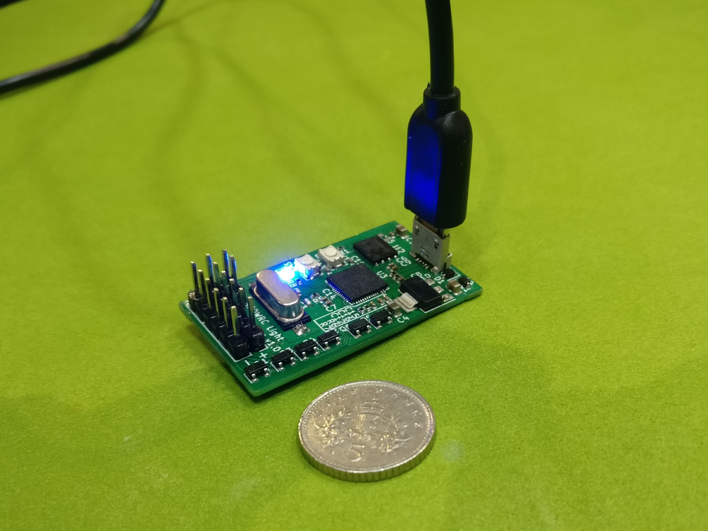
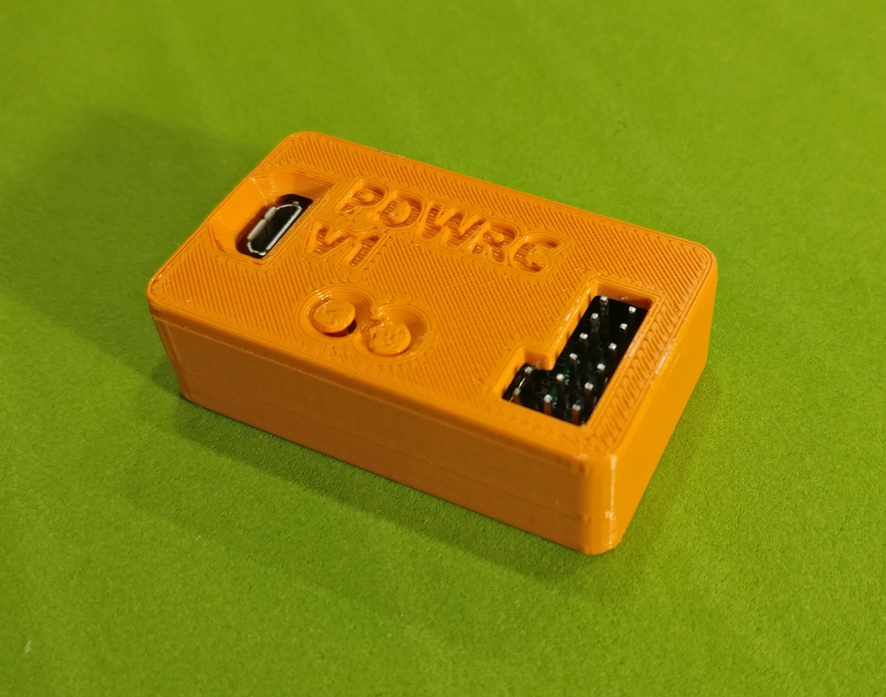
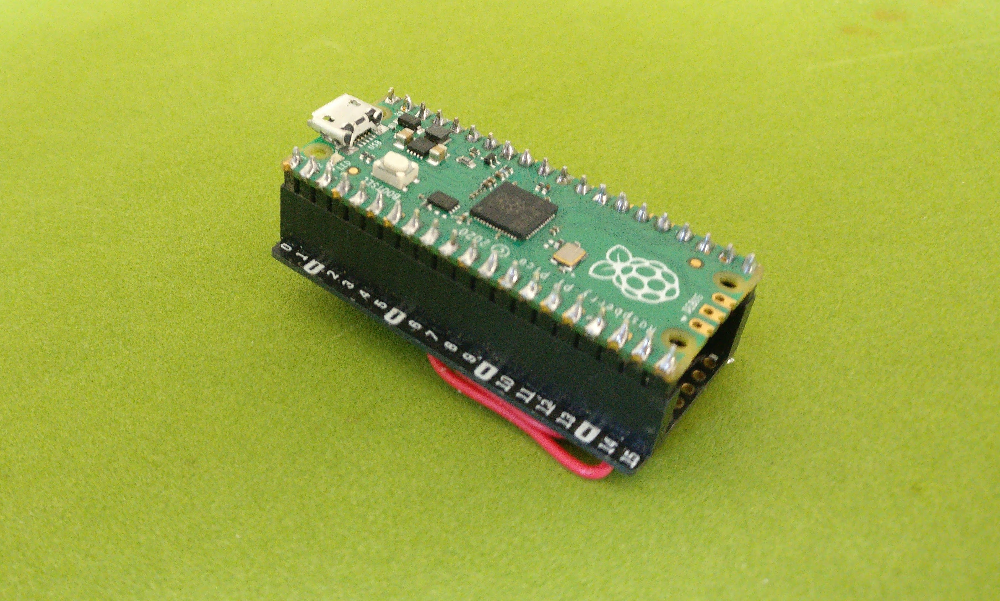
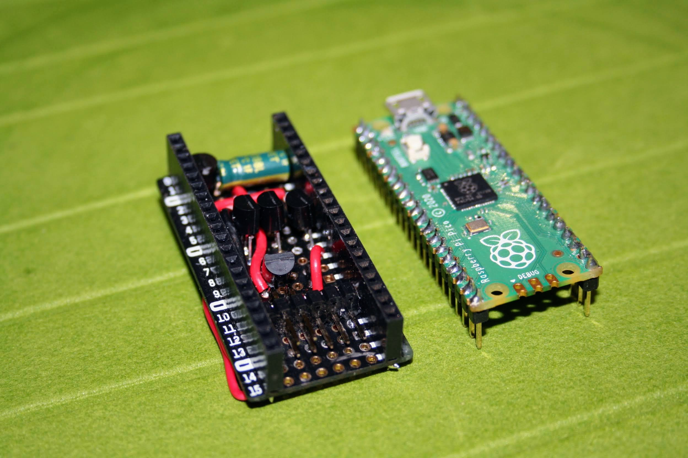
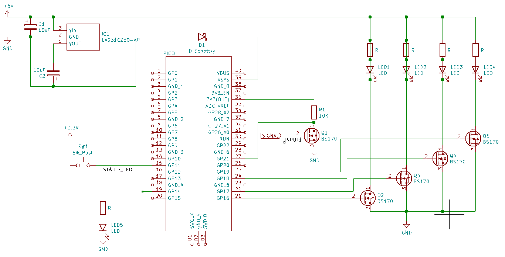

# Open Source RC Light Controller

This project contains software and instructions for building a multi-channel
light controller for RC cars.

The controller is intended to be highly configurable, and the firmware is open
source, so it can be customised to do whatever you want.

It can be used a simple remote switch, operated by an AUX channel on your
transmitter, or it can provide multiple lighting modes, brake lights and turn
signals.

The controller is built around the Raspberry Pi Pico microcontroller, and if
you're comfortable using a soldering iron, it can be assembled very easily from
just a handful of components.

## Features

The controller can be configured to have different lighting modes, selected
using a spare channel on the transmitter, with different brightnesses for
individual channels in the different modes.  

It can configured to activate brake lights automatically, or using a button on
the transmitter.

The controller has a configurable "soft on"/"soft off" setting, which makes
LEDs look more like traditional incandescent bulbs.

The controller can be configured and controlled using a single channel in a
single direction, which means it can shared a channel with another function
(e.g. handbrake).

## Spektrum Smart support

The controller and software are optimised for use with Spektrum Smart receivers
and ESCs.  When used in conjunction with a Smart ESC and receiver, additional
functionality is available, as the controller can use telemetry data to detect
when the car is moving and braking, and has access to all RC control channels
on a single cable.

Additional features include:

* Improved automated brake light mode.
* Read out of current and minimum battery voltage.
* Fine adjustment of brightness levels using the AVC knob on the transmitter.
* A "flash" mode, available when the vehicle is moving.

A Spektrum Smart receiver and ESC communicate using the SRXL2 protocol rather
than PWM.  This allows a single connection to get access to control data for
all channels, and gives access to ESC telemetry data, which is useful for
reliably detecting when the ESC is braking, and when the car is moving.

## PWM mode

If you're not using Spektrum Smart equipment, the controller will operate in
"PWM mode".  This requires a separate input for each channel, e.g. two if you
want an aux switch and throttle, three if you want to add steering for turn
signals.

# Software

To install the software, first flash your Pico with [MicroPython firmware](https://micropython.org/download/rp2-pico/).

Once done, use [mpremote](https://docs.micropython.org/en/latest/reference/mpremote.html), [rshell](https://github.com/dhylands/rshell) or [pyboard.py](https://github.com/micropython/micropython/blob/master/tools/pyboard.py) to copy the contents of the `python` directory onto the Pico.  With `mpremote`, this is done as follows:

```
mpremote fs cp python/*.py :
```

You can now start the controller using the following command:

```
mpremote run python/controller.py
```

This should show some debug output from the firmware.  To make the controller
run automatically on boot, install `controller.py` as `main.py`:

```
mpremote fs cp python/controller.py :main.py
```

# Hardware

The light controller can be built as a DIY project using a Pi Pico
microcontroller.  I also have a design for a custom PCB that combines all the
required components onto a single, compact board. 

## The PDWRC board

The PDWRC v1 board is a pre-built, two-input, four-channel controller built
around the Pico's RP2040 processor.  I am working on making these available for
sale.  Please contact me for more information.





## DIY Hardware

As noted above, the controller uses the Raspberry Pi Pico microcontroller.  The
controller needs a number of additional components in order to ensure that
inputs and supply voltage are within the Pico's limits, and to switch the LED
load currents.

Assembling the controller will require some sort of prototyping board.  It is
possible to buy [boards that are designed to sit under the
Pico](https://thepihut.com/products/pico-proto) itself, and it is possible to
build a 3 channel controller on one of these, as shown below:





The required circuit is shown in the schematic below:



The schematic is also available as a [PDF](kicad/light-controller.pdf) 

### Power supply

The "6V" in the schematic refers to whatever voltage your BEC is running at.

The Pico requires an input voltage of no more than 5.5V, but will operate on
anything above 1.8V.  RC BECs typically run at between 5V and 8V, so if you are
running at more than 5.5V, you will need some way of dropping the supply voltage.

The suggested circuit uses an L4931 voltage regulator to drop the supplied
voltage to 5V.  The L4931 has a low drop out which means that it can deliver 5V
from a 6V input.  If you only ever want to run off 7.4V, there's no need for
low drop-out, and you could use any old 5V regulator.

If you only want to run off 6V, you could replace the regulator, capacitors and
the Schottky diode (D1) with a simple signal diode that will knock 0.7V off the
supply voltage.

A normal diode is fine in place of the Schottky diode, and it probably isn't
needed anyway.  It's to prevent the RC power supply from being back-powered by
the Pico's USB port, if connected.

## Inputs

The FET in the input pin is to prevent the Pico's input from seeing more than
3.3V.  If you're using PWM mode, you'll need to add an additional FET and
resistor for each channel you want to sample.  These can be connected to any
GPIO port.

The Spektrum Smart protocol uses 3.3V so in theory this isn't needed if using
Spektrum Smart equipment, but this provides protection should the receiver fail
to enter Smart mode for any reason.  This input needs to be connected to a pin
that can be used as a UART input (e.g. GPIO 21).

### Output

The schematic shows BS170s as the output drivers, as these can control a
current of up to 500mA each.  2N7000 FETs could also be used, but these have a
limit of 200mA.

More output channels can be added easily, up to the Pico's limit of 16 PWM
output pins.

### LED voltage

The circuit shown above will power the LEDs from the BEC.  You should ensure
that the LEDs have appropriate current-limiting resistors for your BEC voltage,
and that the current drawn is within the BEC's capability.  LEDs designed to
run off a BEC should have this already.

If you want to run the LEDs at a different voltage, or directly from your main
battery, that should work fine - simply remove the link between the "6V" BEC
supply and the common positive input to the LEDs, and connect them to another
power source.  If doing this, make sure that the supply shares a common ground
with the BEC.

This should make it possible to drive LEDs that require a specific voltage,
such as the Traxxas 3V system.

### Status LED and hardware button

The status LED and hardware button are both optional.  The firmware will use
the Pico's built in status LED, so this external LED simply allows you to use a
brighter LED, or to put it elsewhere.

The hardware button performs the same function as the button operated by the
aux channel.  This allows the controller to be used and configured on a
transmitter without an aux channel, although obviously this would lose the
ability to remotely control the lights.

